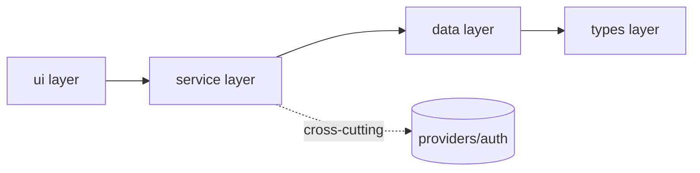

<!--
PROPAGATED FROM: /home/admin/gh/harness-engineering/.harness/doc-templates/architecture.md
SOURCE SHA at copy time: a181c9cf1dcce57e37a54658c1f0c5b3a8f4900b349bd71207bf4f1899daf585
COPIED ON: 2026-06-09
DRIFT DETECTION: re-diff quarterly.
FUTURE: move to ~/.claude/shared-rules/doc-templates/ + pin version per consumer.
-->
---
# REQUIRED FRONTMATTER (validated by doc-lint CI)
title: "<component / subsystem name, <=120 chars>"
status: draft            # draft | active | validated | deprecated | archived | experimental
owner: "@github-handle-or-team-slug"
created: 2026-06-09
updated: 2026-06-09
type: architecture
scope: "<module-path | service-name | 'global' (only at docs/architecture/ root)>"
layer: service           # types | config | data | service | runtime | ui | providers | cross-cutting
rule_class: invariant    # architecture docs default to invariant — use 'default' only for soft conventions

# Required for type=architecture
supersedes: []           # wikilinks to prior architecture docs this replaces
superseded_by: null      # wikilink (or null while current)
decision_log_link: "[[plans/in-progress/<plan>.md#decision-log]]"

# DOC-LINT-040: Guardrails section MUST exist; mirror its content into frontmatter
guardrails:
  - rule: "<rigid invariant, e.g. 'All external data validated against schema at ingress'>"
    rule_class: invariant
    negotiable: false   # death-rule marker (ep06 06-0101)
    enforced_by:
      - { kind: schema, ref: "schemas/<x>.json" }
      - { kind: test,   ref: "tests/test_<x>_boundary.py" }

related:
  - "[[AGENTS.md]]"
  - "[[docs/architecture/architecture.md]]"          # bird's-eye index
  - "[[docs/providers/<concern>.md]]"                # cross-cutting entry points (DOC-LINT-047)

verifiable_claims:
  - claim: "Module exposes only the public surface listed in ## Component Inventory"
    enforced_by: "tests/test_public_api.py::test_<component>_surface"
  - claim: "No back-reference from this layer to a higher layer"
    enforced_by: "tools/dep_lint.py --layer=<layer> --strict"

enforced_by:
  - { kind: lint-rule, ref: "DOC-LINT-046" }   # forward-only deps
  - { kind: ci-job,    ref: ".github/workflows/architecture-lint.yml" }
---

# Architecture: <Component Name>

<!--
  DOC-LINT-003: this doc MUST contain ## Tools, ## Architecture, ## Context H2s.
  DOC-LINT-040: this doc MUST contain ## Guardrails.
  DOC-LINT-012: ## Component Inventory must be structured (table/YAML), not prose.
  Below the "Below Invariant Line ─────" marker, implementation guidance may live;
  above it, only invariants (ep06 06-0050, 06-0112, DOC-LINT-008, DOC-LINT-044).
-->

## Problem
<!-- Why this component exists. What user/agent need it serves. 3-5 sentences. -->

## Solution
<!-- The shape of the answer. WHAT the component is and is not.
     No implementation walkthrough above the invariant line. -->

## Tools
<!-- DOC-LINT-003: enumerate CLIs / APIs / scripts the agent uses to interact with
     this component. One bullet per tool: command + one-line purpose + link to
     deeper doc (ep03 00-0035). -->

- `tool-name <args>` — <one-line purpose> → [[docs/runbooks/<tool>.md]]
- `another-tool` — <one-line purpose> → [[docs/runbooks/<another>.md]]

## Architecture
<!-- DOC-LINT-003 + DOC-LINT-012: structured component inventory, not prose.
     Use the table below or a YAML block. This is the DOM-snapshot of the system
     (ep04 04-0213). -->

### Component Inventory

| Component   | Layer    | Public Surface           | Owner         | Quality Score |
|-------------|----------|--------------------------|---------------|---------------|
| `<name>`    | service  | `POST /x`, `GET /x/{id}` | @team-slug    | validated     |
| `<name>`    | data     | `repo.find(id)`          | @team-slug    | draft         |
| `<name>`    | types    | `Widget`, `WidgetId`     | @team-slug    | validated     |

### Diagram



## Context
<!-- DOC-LINT-003: domain glossary + invariants the agent must hold while reading
     code in this component (ep03 00-0035). -->

### Glossary
- **Widget** — <definition>
- **WidgetId** — <definition + format>

### Domain Invariants
- Every Widget has exactly one owner at all times
- WidgetId is immutable post-creation

## Guardrails
<!-- DOC-LINT-040: rigid invariants only. Each entry must have an enforcer.
     Use SHOULD/MAY only below the invariant line (DOC-LINT-017, DOC-LINT-043). -->

1. **External data schema-validated at ingress** (rule_class: invariant, negotiable: false, ep06 06-0057)
   - enforced_by: `schemas/widget.create.request.json`, `tests/test_api_boundary.py`
2. **Forward-only layer dependencies** (rule_class: invariant, ep06 06-0137)
   - enforced_by: `tools/dep_lint.py --strict`, DOC-LINT-046
3. **Auth enters only via providers/auth** (rule_class: invariant, ep06 06-0242)
   - enforced_by: `tests/test_no_inline_auth.py`, DOC-LINT-047

## Validation
<!-- Executable proof the architecture invariants hold today (ep04 04-0217). -->

```bash
make architecture.<component>.verify
# runs: dep_lint, boundary tests, schema validation, public-surface diff
# expected exit code: 0
```

## Risk
<!-- What kind of change would break a guardrail? Which downstream invariants
     depend on this one? -->

- **Downstream dependents:** <list of components / docs that rely on guardrails above>
- **Highest-risk change class:** <e.g. "any new public method bypassing schema validation">
- **Sunset / deprecation plan:** <when superseded_by is set, fill this in>

## Below Invariant Line ─────────────────────────────────────
<!-- DOC-LINT-044: everything below this marker is `scope: below-invariant`.
     Implementation guidance, example code, optional patterns may live here.
     Hedge words allowed (SHOULD/MAY); MUST/SHALL not allowed here. -->

### Example Implementation Pattern
<!-- Optional. Concrete example showing one valid way to satisfy the guardrails.
     This is guidance, NOT a contract. Agents may choose other implementations. -->

```python
# Example: schema-validated ingress (one of many valid shapes)
def create_widget(payload: dict) -> Widget:
    validated = WidgetCreateRequest.model_validate(payload)  # guardrail #1
    return widget_repo.insert(validated)                      # guardrail #2 (forward-only)
```

### Conventions (soft)
- Prefer `repository.find(...)` over raw SQL in services
- Logging keys SHOULD use snake_case (advisory, not invariant)

## Citations
<!-- Source-attributed anchors. Use [NN-mmss] format matching SEARCH.json
     (NN = episode 01-30, mmss = mm:ss timestamp). Each cited anchor MUST
     resolve to a SEARCH.json entry — doc-lint verifies. -->

- [00-0035] Agents are blind — Tools / Architecture / Context are required scaffolding
- [04-0213] DOM-snapshot equivalent — structured inventory not prose
- [06-0050] Enforce invariants, not implementation
- [06-0101] Invariants are death-rules; defaults are overridable
- [06-0130] Layered taxonomy is the enforced architecture
- [06-0137] Forward-only dependencies
- [06-0242] Cross-cutting concerns through single Providers entry
- [08-0035] Architecture-design history is first-class repo artifact

<!-- ───────────────────────────────────────────────────────────────── -->
<!-- Source: harness-engineering G2 corpus; lint rules: scripts/doc_lint.py -->
<!-- ───────────────────────────────────────────────────────────────── -->

<!-- ============================================================== -->
<!-- EXAMPLE FRAGMENT (delete before merge)                          -->
<!-- ============================================================== -->
<!--
## Component Inventory
| Component         | Layer   | Public Surface                    | Owner   | Quality   |
|-------------------|---------|-----------------------------------|---------|-----------|
| `dl_one.py`       | runtime | `dl_one.py <bvid> <dir> <idx>`    | @eddie  | validated |
| `process_batch.py`| runtime | `process_batch.py <root> <mp4..>` | @eddie  | validated |
| `build_grouped_index.py` | runtime | `build_grouped_index.py <root>` | @eddie | validated |

## Guardrails
1. **Idempotency by file-existence check** (negotiable: false)
   - enforced_by: tests/test_idempotency.py, env vars FORCE_ASR / FORCE_SLIDES
2. **`DONE_JSON {...}` is the final stdout line of every script** (negotiable: false)
   - enforced_by: tests/test_done_json_contract.py
-->
