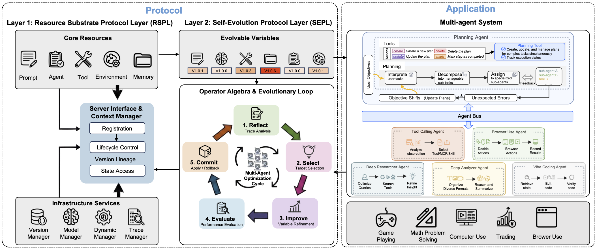

# Autogenesis

**Note:** The codebase is currently undergoing active refactoring and optimization. `examples/run_tool_calling_agent.py` is functional; other agents are being progressively stabilized as part of this effort.

English | [中文说明](README_zh.md)

Autogenesis is a self-evolution protocol and runtime for LLM-based agent systems.

Recent agent protocols often under-specify cross-entity **lifecycle/context management**, **version tracking**, and **safe evolution update interfaces**, which encourages monolithic compositions and brittle glue code. Autogenesis addresses this by decoupling **what evolves** from **how evolution occurs**:

- **RSPL (Resource Substrate Protocol Layer)**: models *prompts, agents, tools, environments, and memory* as protocol-registered resources with explicit **state**, **lifecycle**, and **versioned** interfaces.
- **SEPL (Self Evolution Protocol Layer)**: specifies a closed-loop operator interface to **propose**, **assess**, and **commit** improvements with auditable lineage and **rollback**.

Built on Autogenesis, the system includes an **Autogenesis-Agent** style tool-calling agent that can dynamically instantiate/retrieve/refine resources and improve during execution.

## Architecture



## Self-evolution at a glance

At a high level, Autogenesis supports an iterative loop:

- **Act**: an agent produces actions/outputs using an LLM and the available tools/environments.
- **Observe**: capture outcomes, traces, intermediate reasoning, and environment feedback.
- **Optimize**: update prompts/solutions/variables using an optimizer (e.g., reflection or RL-style methods).
- **Remember**: persist summaries/insights/records to memory for later steps and sessions.

## Core building blocks

- **Agents (`src/agent/`)**: runtime logic that decides *what to do next* (planning, tool-calling, domain agents, etc.).
- **Tools (`src/tool/`)**: callable capabilities exposed to agents (workflow tools + default tools).
- **Environments (`src/environment/`)**: stateful interfaces that tools/agents can interact with (filesystem, trading backtest envs, browser/mobile envs, etc.).
- **Memory (`src/memory/`)**: session/event memory systems for summarization, insights, and long-term state.
- **Optimizers (`src/optimizer/`)**: self-improvement algorithms that turn feedback into updated prompts/solutions/variables (reflection, GRPO, Reinforce++, etc.).
- **Tracing & versioning (`src/tracer/`, `src/version/`)**: record trajectories and manage iterative artifacts across runs.
- **Config system (`configs/`, `src/config/`)**: MMEngine-style configs to compose agents/tools/envs/memory/models consistently.

## Design goals

- **Composable**: add/replace agents, tools, environments, memory systems, and optimizers without rewriting the whole stack.
- **Inspectable**: structured traces and memory events make it easier to analyze failures and improvement steps.
- **Evolvable**: explicit optimizers + persistent memory enable iterative refinement rather than one-shot inference.

## Repository layout

```
Autogenesis/
  configs/                 # config composition (agents/tools/envs/memory/models)
  src/
    agent/                 # agents
    environment/           # environments
    tool/                  # tools
    memory/                # memory systems
    optimizer/             # self-evolution optimizers
    model/                 # model manager + provider backends
    prompt/                # prompt templates / prompt manager
    tracer/                # tracing
    version/               # versioning
  libs/                    # vendored libraries
  workdir/                 # runtime artifacts (logs, traces, results, etc.)
```

## Optional: run a Tool-Calling Agent

Prerequisites:
- Install dependencies in your environment, please refer to [INSTALL.md](scripts/INSTALL.md)
- Copy `.env.template` to `.env` and set environment variables.

Example:

```bash
python examples/run_tool_calling_agent.py --config configs/tool_calling_agent.py
```

## Citation
```
@misc{zhang2026autogenesisselfevolvingagentprotocol,
      title={Autogenesis: A Self-Evolving Agent Protocol}, 
      author={Wentao Zhang and Zhe Zhao and Haibin Wen and Yingcheng Wu and Cankun Guo and Ming Yin and Bo An and Mengdi Wang},
      year={2026},
      eprint={2604.15034},
      archivePrefix={arXiv},
      primaryClass={cs.AI},
      url={https://arxiv.org/abs/2604.15034}, 
}
```