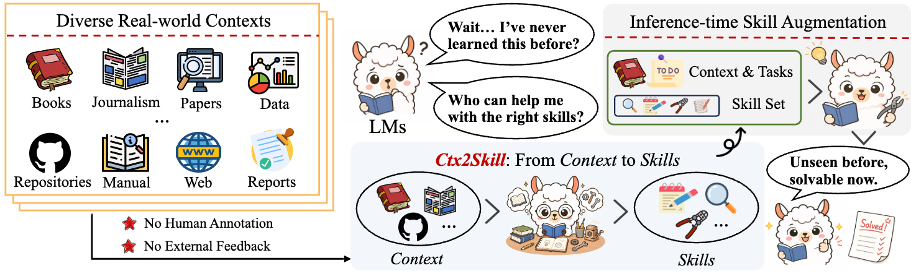
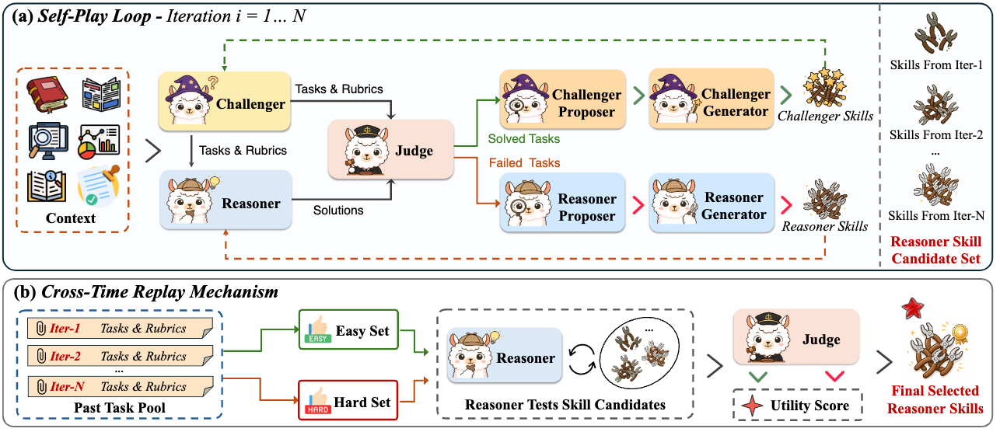

# Ctx2Skill: From Context to Skills


> **Can Language Models Learn from Context Skillfully?**

The code of our paper "**From Context to Skills: Can Language Models Learn from Context Skillfully?** ".

Ctx2Skill is a self-evolving framework that autonomously discovers, refines, and selects context-specific skills from complex contexts, requiring **no human annotation** and **no external feedback**. The resulting natural-language skills can be plugged into any language model at inference time to enhance context learning capability.

<p align="center">
  
</p>

## Overview

Many real-world tasks require language models to reason over complex contexts (e.g., technical documents, research papers, code repositories) that lie outside their parametric knowledge. An intuitive solution is **inference-time skill augmentation** — extracting rules and procedures from the context into explicit, natural-language skills. However, constructing such skills faces two fundamental challenges:

1. **Prohibitive cost** of manual skill annotation for long, technically dense contexts
2. **Lack of external feedback** for automated skill construction in context learning scenarios

Ctx2Skill addresses both challenges through a **multi-agent self-play loop**:

<p align="center">
  
</p>

## Method

### Multi-Agent Self-Play Loop

The core of Ctx2Skill is a self-play loop comprising five frozen-LM agent roles:

| Agent | Role |
|-------|------|
| **Challenger** | Generates probing tasks and rubrics based on the context and its own evolving skill set |
| **Reasoner** | Attempts to solve tasks guided by the context and its current skill set |
| **Judge** | Provides binary per-rubric verdicts and partitions tasks into solved/failed sets |
| **Proposer** (one per side) | Diagnoses failure/success patterns and synthesizes high-level skill update proposals |
| **Generator** (one per side) | Materializes proposals into concrete skill set updates |

Both the Challenger and Reasoner co-evolve through accumulated natural-language skills: failed cases drive Reasoner skill updates, while easily solved cases drive Challenger skill updates, maintaining sustained adversarial pressure.

### Cross-Time Replay Mechanism

A key risk in self-play is **adversarial collapse** — the Challenger generates increasingly extreme tasks while the Reasoner's skills over-specialize. To address this, the Cross-Time Replay mechanism:

- Collects representative hard/easy probe tasks during self-play
- Re-evaluates all historical skill set candidates on these probes
- Selects the skill set that maximizes the product of hard-set and easy-set solving rates, ensuring robust generalization

## Results

Evaluated on four context learning tasks from CL-bench, Ctx2Skill consistently improves solve rates across backbone models:

| Model | Without Skills | With Ctx2Skill | Improvement |
|-------|---------------|----------------|-------------|
| GPT-4.1 | 11.1% | 16.5% | +5.4% |
| GPT-5.1 | 21.2% | 25.8% | +4.6% |
| GPT-5.2 | 18.2% | 21.4% | +3.2% |

We conduct our experiments using newapi for GPT-4.1, and azure-api for GPT-5.1 and GPT-5.2. We provide the logs and generated responses in this [link](https://huggingface.co/datasets/ssz1111/Ctx2Skill) for reproducibility and analysis. We recommend **GPT-5.2** for reproduction, as it yields the most consistent results during our early experiments. We also provide our generated skills in this [link](https://huggingface.co/datasets/ssz1111/Ctx2Skill-Skills).

## Quick Start

### Prerequisites

- Python 3.8+
- OpenAI-compatible API access

### Installation

```bash
git clone https://github.com/S1s-Z/Ctx2Skill.git
cd Ctx2Skill
```

### Data Preparation

Download the CL-Bench dataset from this [link](https://huggingface.co/datasets/ssz1111/Ctx2Skill) files and place them in the project root:
- `CL-bench-context-dedup.jsonl` — deduplicated contexts (used for skill generation)
- `CL-bench-with-task-delimiter.jsonl` — tasks with delimiters (used for evaluation)
- Evaluation logs and responses from GPT-4.1, GPT-5.1, and GPT-5.2.

### Running the Self-Play Loop

```bash
# Configure API
export OPENAI_BASE_URL="your-api-base-url"
export OPENAI_API_KEY="your-api-key"

# Run the self-play skill discovery loop
python selfplay_loop.py \
    --challenger-model gpt-5.2 \
    --reasoner-model gpt-5.2 \
    --judge-model gpt-5.1 \
    --proposer-model gpt-5.2 \
    --generator-model gpt-5.2 \
    --input ./CL-bench-context-dedup.jsonl \
    --output outputs/loop_data/loop_output.jsonl \
    --num-iterations 5 \
    --num-tasks 5 \
    --skills-dir skills-output \
    --workers 32
```

### Inference with Discovered Skills

```bash
python infer.py \
    --model gpt-5.2 \
    --input ./CL-bench-with-task-delimiter.jsonl \
    --workers 32 \
    --skills-dir skills-output/reasoner \
    --output outputs/inference_output.jsonl
```

### Evaluation

```bash
python eval_ignore_none.py \
    --input outputs/inference_output.jsonl \
    --judge-model gpt-5.1 \
    --workers 32
```

## Project Structure

```
Ctx2Skill/
├── selfplay_loop.py       # Main self-play loop with all five agents
├── challenger.py           # Challenger agent implementation
├── infer.py                # Inference script with skill augmentation
├── eval.py                 # Evaluation script
├── eval_ignore_none.py     # Evaluation script (ignoring None responses)
├── prompts/                # Prompt templates for each agent role
│   ├── challenger.txt
│   ├── challenger_generator.txt
│   ├── challenger_proposer.txt
│   ├── reasoner_generator.txt
│   └── reasoner_proposer.txt
└── run.sh                  # Example run script
```

## Citation

```bibtex
@misc{si2026contextskillslanguagemodels,
      title={From Context to Skills: Can Language Models Learn from Context Skillfully?}, 
      author={Shuzheng Si and Haozhe Zhao and Yu Lei and Qingyi Wang and Dingwei Chen and Zhitong Wang and Zhenhailong Wang and Kangyang Luo and Zheng Wang and Gang Chen and Fanchao Qi and Minjia Zhang and Maosong Sun},
      year={2026},
      eprint={2604.27660},
      archivePrefix={arXiv},
      primaryClass={cs.AI},
      url={https://arxiv.org/abs/2604.27660}, 
}
```


## License

This project is released under the MIT License.
