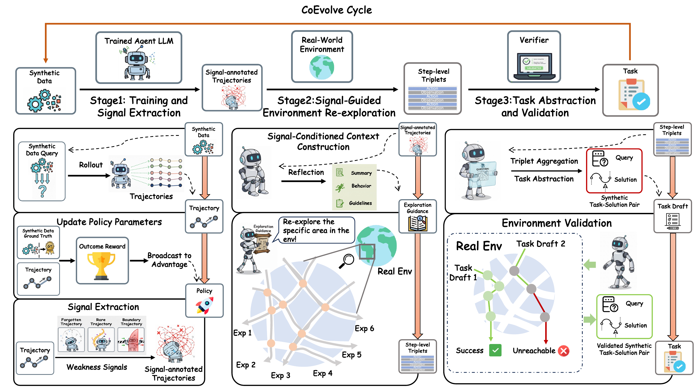

<h1 align="center">CoEvolve: Training LLM Agents via Agent-Data Mutual Evolution</h1>


<p align="center">
  Shidong Yang*,
  Ziyu Ma*,
  Tongwen Huang*,
  Yiming Hu,
  Yong Wang&dagger;,
  Xiangxiang Chu
  <br />
  AMAP, Alibaba Group
  <br />
  * Equal contribution. &dagger; Project lead and corresponding author.
</p>

<div align="center">

[](https://arxiv.org/abs/2604.15840)
[](./LICENSE)

</div>

## News
- [2026.04]: 🚀 [SkillClaw](https://github.com/AMAP-ML/SkillClaw) released — a real-environment collective skill evolution system where reusable agent skills evolve from every interaction across sessions, agents, devices, and users, allowing distributed experience to compound into collective intelligence.
- [2026.04]: 🎉 Our paper is accepted to ACL 2026

## Table of contents
- [Overview](#overview)
- [Acknowledgement](#acknowledgement)
- [Citation](#citation)
- [License](#license)

## Overview
CoEvolve studies reinforcement learning for LLM agents under a changing training distribution. Instead of relying on a fixed pool of expert demonstrations or static synthetic trajectories, CoEvolve closes the loop between the agent and its data: the current policy interacts with the environment, failure signals are extracted from rollouts, and those signals guide the synthesis of new tasks that are validated and folded back into training.

<p align="center">
  
</p>

## Acknowledgement
This codebase is developed on top of [AgentEvolver](https://github.com/modelscope/AgentEvolver) and [veRL](https://github.com/volcengine/verl). Some components are inspired by [CuES](https://github.com/modelscope/AgentEvolver). We sincerely thank the authors and contributors of these open-source projects.


## Citation
If you find this repository useful in your research, please cite the arXiv version below:

```bibtex
@article{yang2026coevolve,
  title={CoEvolve: Training LLM Agents via Agent-Data Mutual Evolution},
  author={Shidong Yang and Ziyu Ma and Tongwen Huang and Yiming Hu and Yong Wang and Xiangxiang Chu},
  journal={https://arxiv.org/abs/2604.15840},
  year={2026}
}
```

## License
Apache-2.0. See `LICENSE` for details.
