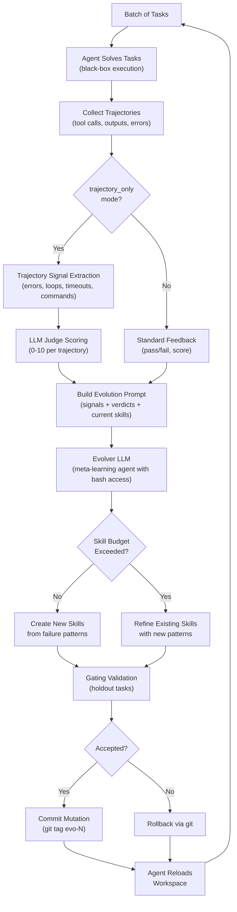
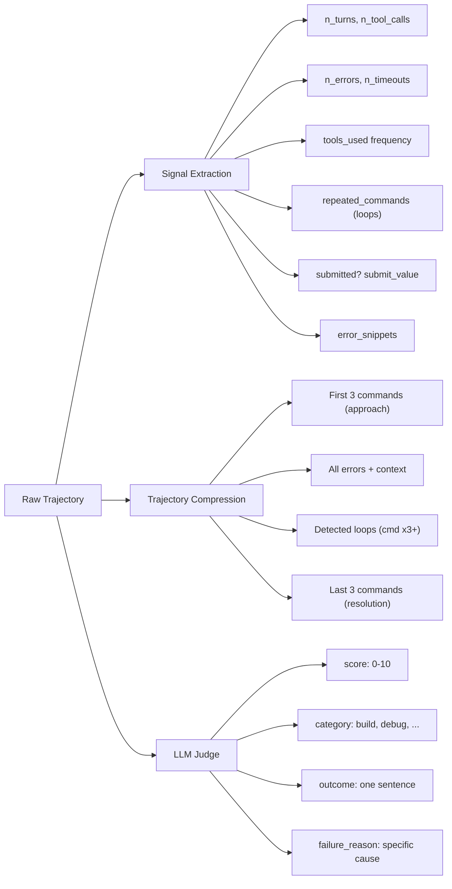
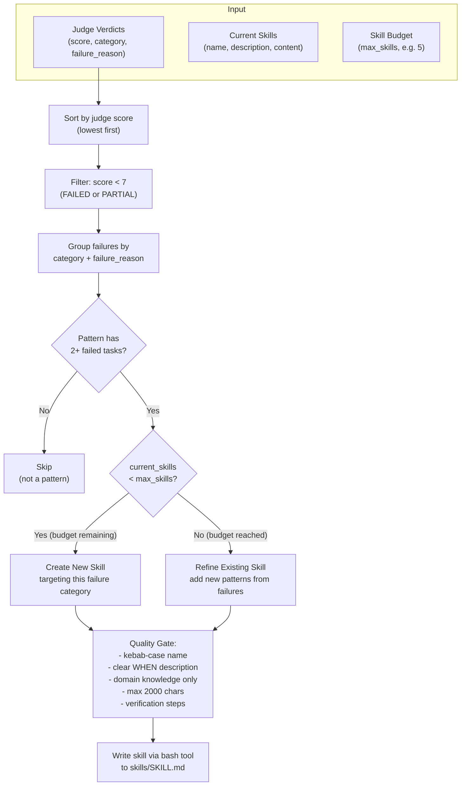
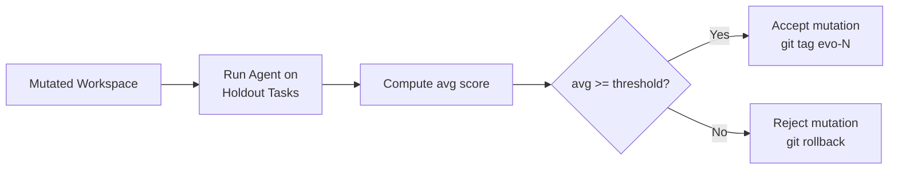
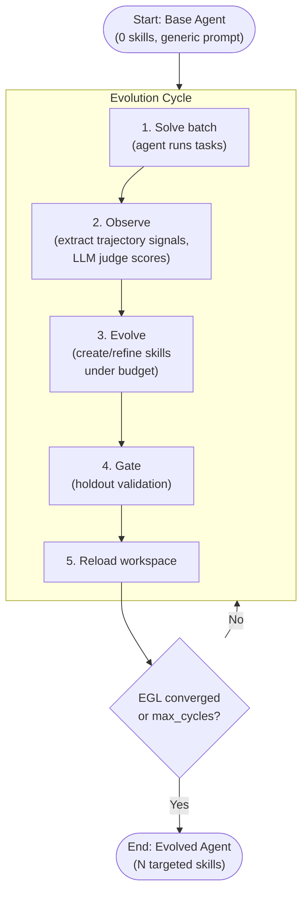

# Adaptive Skill — In-Situation Evolution Without Labels

`adaptive_skill` evolves an agent's skill library by analyzing trajectories from a batch of tasks — without ever seeing ground-truth labels, test results, or pass/fail signals during evolution.

## Core Idea

Most evolution algorithms rely on a labeled evaluation signal: the agent solves tasks, a judge tells it which answers were right, and the evolver learns from that feedback. Adaptive Skill removes the label dependency entirely. The evolver only sees **what the agent did** (commands, errors, loops, outputs), never **whether it succeeded**. An LLM judge estimates success from behavior, and the evolver uses those proxy signals to decide which skills to create.

This makes Adaptive Skill suitable for domains where:

- Ground-truth evaluation is expensive, slow, or unavailable during evolution.
- The agent operates in open-ended environments (terminal, CLI, system administration).
- You want to evolve continuously on live traffic without waiting for labeled feedback.

## Algorithm Overview



## Detailed Flow

### Phase 1 — Solve

The agent processes a batch of tasks in a black-box manner. Each task produces a **trajectory**: the full sequence of tool calls, commands, outputs, and errors the agent encountered.

### Phase 2 — Observe (Trajectory-Only)

Instead of collecting labeled feedback, the algorithm extracts **behavioral signals** from each trajectory:



The **LLM Judge** acts as a proxy evaluator. It reads the compressed trajectory and estimates:

| Field | Description |
| :--- | :--- |
| `score` (0-10) | 0 = complete failure, 5 = partial progress, 10 = likely solved |
| `category` | Task type (build, debug, data-science, security, system-admin, ...) |
| `outcome` | One-sentence description of what happened |
| `failure_reason` | Specific thing that went wrong (if score < 7) |

### Phase 3 — Evolve (Skill Mutation Under Budget)

The evolver LLM receives all signals and verdicts, plus the current skill library, and decides what to mutate. This is where the **skill budget** controls growth.



#### Skill Budget

The skill budget (`max_skills`, default 5) prevents unbounded skill library growth:

| State | Behavior |
| :--- | :--- |
| `current < max_skills` | Evolver may create new skills for uncovered failure categories |
| `current >= max_skills` | **No new skills allowed.** Evolver must refine existing skills instead |

The budget forces the evolver to produce **general, high-coverage skills** rather than one-off fixes. As the library fills up, new failure patterns must be folded into existing skills that cover the closest category.

#### What the Evolver Writes

Each skill is a `SKILL.md` file with YAML frontmatter:

```yaml
---
name: build-legacy-c-projects
description: >
  When building legacy C/C++ projects that fail with missing GUI/X11
  dependencies or outdated Makefiles.
---

## Steps
1. Check for optional GUI dependencies (X11, SDL, ncurses) and disable them
   via configure flags or Makefile edits.
2. ...

## Verification
- `make` completes with exit code 0
- Binary exists in expected output path
```

Skills are loaded **on demand** by the agent via `read_skill(name)` — the agent sees skill names and descriptions in its system prompt and decides which to read for a given task.

### Phase 4 — Gate (Optional)

After the evolver mutates the workspace, the **gating strategy** validates the mutation:



Holdout tasks are sampled from the benchmark (default 20% holdout ratio). If the mutated agent regresses on holdout tasks, the entire mutation is rolled back via git.

### Phase 5 — Reload & Converge (Optional)

The agent reloads its workspace (skills, prompts, memory) and the loop repeats. Convergence is tracked via **EGL (Evolutionary Generality Loss)**:

```
EGL = (new_skills_created / total_tasks_solved) * 1000
```

When EGL stays below a threshold (default 0.05) for a configurable window (default 3 cycles), the evolution is considered converged — the agent has stabilized and is no longer discovering new failure patterns.

## End-to-End Lifecycle



## Configuration

Key config fields for Adaptive Skill (set via YAML or `EvolveConfig`):

| Parameter | Default | Description |
| :--- | :--- | :--- |
| `trajectory_only` | `True` | Only show trajectories to evolver (no labels) |
| `max_skills` | `5` | Skill budget — max number of skills allowed |
| `evolve_skills` | `True` | Allow skill creation/modification |
| `evolve_prompts` | `True` | Allow system prompt edits |
| `evolve_memory` | `True` | Allow memory updates |
| `protect_skills` | `False` | If True, existing skills are read-only (only new creation allowed) |
| `solver_proposed` | `False` | If True, the solver agent proposes draft skills for the evolver to generalize |
| `prompt_only` | `False` | If True, only system prompt mutations are allowed (no skills) |
| `batch_size` | `10` | Number of tasks per evolution cycle |
| `holdout_ratio` | `0.2` | Fraction of tasks reserved for gating validation |
| `egl_threshold` | `0.05` | EGL convergence threshold |
| `egl_window` | `3` | Number of consecutive cycles EGL must stay below threshold |

## Key Design Decisions

**Why no labels?** In open-ended terminal tasks, ground-truth evaluation can be expensive (spinning up Docker environments, running test suites). By judging from trajectories alone, the evolver can run continuously without waiting for evaluation infrastructure.

**Why a skill budget?** Without a budget, the evolver tends to create narrow, task-specific skills that don't generalize. The budget forces consolidation — five well-crafted category skills outperform twenty fragmented ones.

**Why an LLM judge?** The judge provides a structured signal (score + category + failure reason) that the evolver can sort, filter, and group. Raw trajectories are noisy; the judge distills them into actionable patterns.

## Source Files

| File | Role |
| :--- | :--- |
| [`engine.py`](../../agent_evolve/algorithms/adaptive_skill/engine.py) | `AdaptiveSkillEngine` — orchestrates the step/evolve loop |
| [`prompts.py`](../../agent_evolve/algorithms/adaptive_skill/prompts.py) | Prompt templates, trajectory compression, LLM judge |
| [`gating.py`](../../agent_evolve/algorithms/adaptive_skill/gating.py) | Holdout validation strategy |
| [`egl.py`](../../agent_evolve/algorithms/adaptive_skill/egl.py) | EGL computation and convergence check |
| [`tools.py`](../../agent_evolve/algorithms/adaptive_skill/tools.py) | Bash tool spec and LLM provider factory |
