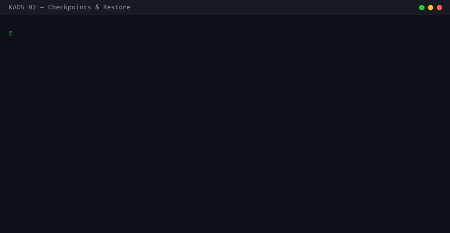

# Checkpoints, Restore & Diff

KAOS snapshots an agent's complete state — files, KV state, and metadata — at any point. You can restore to any snapshot and diff two snapshots to see exactly what changed.



---

## Creating a checkpoint

```python
cp = db.checkpoint(agent_id, label="before-migration")
```

```bash
kaos checkpoint <agent-id> --label "before-migration"
```

A checkpoint captures:
- All files in the agent's VFS (via content-addressable blob references — no data duplication)
- All KV state (`db.set_state(...)`)
- Timestamp and optional metadata

Checkpoints are cheap. Because files are stored as deduplicated blobs, a checkpoint only stores references — not copies.

### Auto-checkpointing

The `ClaudeCodeRunner` creates checkpoints automatically every N iterations (default: 10):

```yaml
# kaos.yaml
ccr:
  checkpoint_interval: 10
```

---

## Listing checkpoints

```python
cps = db.list_checkpoints(agent_id)
# [{"checkpoint_id": "01K...", "label": "before-migration", "created_at": "..."}]
```

```bash
kaos checkpoints <agent-id>
kaos --json checkpoints <agent-id>
```

---

## Restoring

Roll back an agent to a previous snapshot. Every other agent is completely unaffected.

```python
db.restore(agent_id, checkpoint_id)
```

```bash
kaos restore <agent-id> --checkpoint <checkpoint-id>
```

Restore is a SQL operation — it rewrites the agent's file and state rows to match the checkpoint. It takes milliseconds regardless of how many files were changed.

### Pattern: safe operations

```python
cp = db.checkpoint(agent_id, label="pre-migration")
try:
    result = await ccr.run_agent(agent_id, "Migrate schema to v3")
except Exception:
    db.restore(agent_id, cp)
    raise
```

### Pattern: A/B compare

```python
cp_a = db.checkpoint(agent_id, label="approach-A")
# ... run approach A ...
cp_b = db.checkpoint(agent_id, label="approach-B")

# Compare
diff = db.diff_checkpoints(agent_id, cp_a, cp_b)
```

---

## Diffing two checkpoints

```python
diff = db.diff_checkpoints(agent_id, checkpoint_id_a, checkpoint_id_b)
```

```bash
kaos diff <agent-id> --from <checkpoint-id-A> --to <checkpoint-id-B>
```

The diff shows:
- **Files added** — new paths in checkpoint B
- **Files removed** — paths that existed in A but not B
- **Files modified** — paths present in both with different content (SHA-256 mismatch)
- **State changed** — KV keys that were added, removed, or changed value
- **Tool calls between** — calls that happened between the two snapshots

### Example output

```
Files added (2):
  /src/auth_v2.py        4.2 KB
  /tests/test_auth.py    1.8 KB

Files modified (1):
  /src/auth.py           (1.1 KB → 2.4 KB)

Files removed (1):
  /src/auth_legacy.py

State changes:
  progress:  75 → 100
  status:    "in-progress" → "complete"

Tool calls between checkpoints: 12
  8 success, 3 error, 1 running
```

---

## Checkpoint metadata

Attach notes or arbitrary metadata to a checkpoint:

```python
cp = db.checkpoint(agent_id, label="v2-attempt", metadata={
    "notes": "Switched to JWT — session-based auth removed",
    "test_results": {"passed": 14, "failed": 0},
    "triggered_by": "CI pipeline run #428",
})
```

Metadata appears in `kaos checkpoints <agent-id>` and in the dashboard's Checkpoints tab.

---

## How storage works

Files are stored as content-addressable blobs (SHA-256, zstd-compressed). A checkpoint stores blob references, not copies. Two checkpoints that share 95% of the same files cost almost nothing extra in storage.

Garbage collection removes unreferenced blobs. Run it with:

```python
db.gc()  # removes blobs not referenced by any file or checkpoint
```

---

## Export a checkpoint

To share a specific checkpoint state:

```bash
# Export the entire agent (includes all checkpoints)
kaos export <agent-id> -o agent-snapshot.db

# On another machine
kaos import agent-snapshot.db
```
