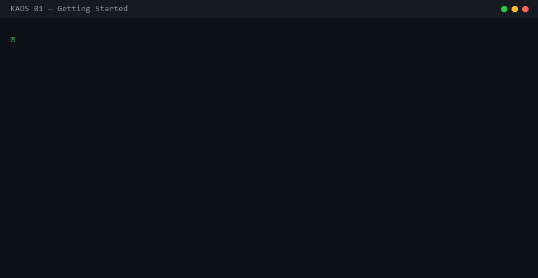

# KAOS Dashboard

The KAOS web dashboard gives you a live view of every agent run — what they're doing, how long they've been running, which ones failed, and a complete timeline of events.

```bash
kaos ui           # open the web dashboard
kaos demo         # demo data + dashboard (no setup needed)
```

---

## Gantt Timeline

The main view is a **Gantt timeline** grouped by execution wave. Each wave is a set of agents that started around the same time — typically one `kaos parallel` run or one MCP-triggered batch.



### What you see

**Wave header** — one card per execution wave, showing:
- The goal (plain-English task description of the wave)
- Start time
- Total duration
- Status bar: proportional split of completed / running / failed / killed agents
- Status pills: count by status

**Gantt rows** — inside each wave, one horizontal bar per agent:
- Bar width = how long the agent ran (relative to the wave)
- Bar color = status: green (completed), purple (running), red (failed), gray (killed/paused)
- Running agents have a shimmer animation
- A vertical "now" line shows the current time on active waves
- Time axis ticks show the time scale (0s → Xm)

**Tooltip** — hover any bar to see the agent's name, role, task, and status.

### Expanding waves

Click a wave header to expand/collapse its agent rows. Waves with running agents expand automatically. Small waves (≤12 agents) also expand by default.

### Filtering

Use the toolbar at the top:
- **Search box** — filters by agent name, task description, or role
- **Status pills** — show only running / done / failed / killed agents

---

## Agent Inspector

Click any agent bar to open the inspector panel on the right. It has five tabs:

### Overview
- Status badge, creation time, last heartbeat
- Files written, tool calls made, tokens used, events recorded
- Full task description
- Config and metadata JSON

### Events
Live-updating list of every event the agent recorded: file reads/writes, tool call starts/ends, state changes, lifecycle events. New events append in real time via SSE.

### Tool Calls
Full call tree: every tool invocation, its input, output, duration, and token count. Nested calls are shown indented. Click a row to expand input/output details.

### Files
Browse the agent's virtual filesystem. Navigate directories, see file sizes. Click a directory to drill in; use the breadcrumb to navigate back.

### Checkpoints
Timeline of all checkpoints for the agent — label, creation time, and metadata notes.

---

## Live Event Feed

The bottom strip shows a real-time stream of events across all agents — file writes, tool calls, completions, failures. Filter by event type using the pills in the header.

Clicking an agent ID in the feed opens that agent in the inspector.

---

## Multi-project

The top bar has a project selector dropdown. Switch between different `.db` files without restarting. Use **+ Project** to open a database at any path.

URL parameter: `http://localhost:8765/?db=/path/to/kaos.db`

---

## Terminal Dashboard

For environments without a browser (SSH, CI), use the TUI:

```bash
kaos dashboard
```

Shows agents in a table with live status updates, token counts, and a scrolling event feed.

---

## Configuration

```bash
kaos ui --port 9000         # custom port (default: 8765)
kaos ui --host 0.0.0.0     # bind to all interfaces (for remote access)
kaos ui --no-browser        # don't auto-open browser
kaos ui --db ./project.db  # specific database
```
