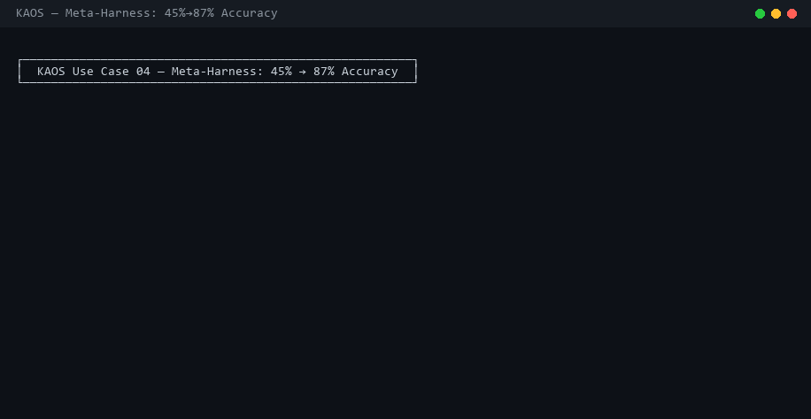
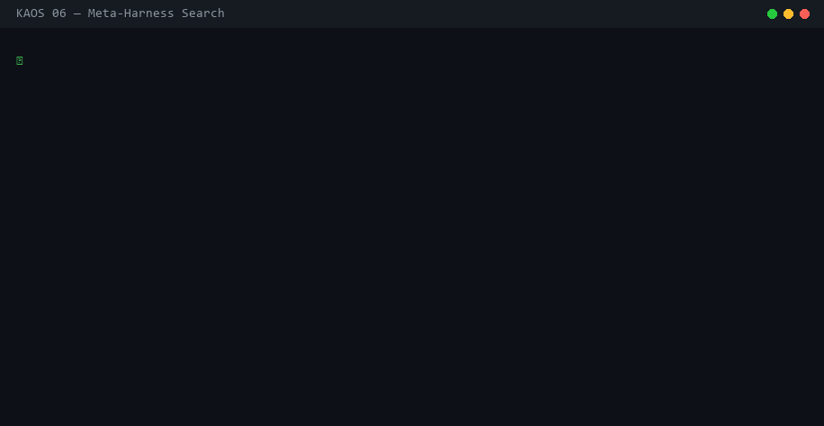

# Meta-Harness: Automated Harness Optimization on KAOS

> Your LLM is only as good as the code wrapping it. Meta-Harness automatically searches for the best harness — the prompt template, retrieval strategy, and memory management — by letting an AI proposer learn from full execution traces.

Based on [Meta-Harness (arXiv:2603.28052)](https://yoonholee.com/meta-harness/) by Lee, Nair, Zhang, Lee, Khattab, and Finn (Stanford/KRAFTON/MIT). Original code: [stanford-iris-lab/meta-harness-tbench2-artifact](https://github.com/stanford-iris-lab/meta-harness-tbench2-artifact).



---

## What Problem Does This Solve?

You have an LLM doing a task — classifying tickets, solving math problems, writing code. The model is fixed. But the **harness** — the code that decides what to put in the prompt, which examples to retrieve, what context to include — makes a **6x performance difference** on the same model.

Currently, you optimize harnesses by hand: try a prompt, check results, adjust, repeat. Meta-Harness automates this entire loop.

## How It Works — Step by Step

Here's what actually happens when you run a Meta-Harness search, using a real example: optimizing a support ticket classifier.

### Step 1: You Define Your Task

```python
# Your data — labeled support tickets
tickets = [
    {"text": "I was charged twice this month", "label": "billing"},
    {"text": "API returns 500 errors on POST", "label": "technical"},
    {"text": "How do I add team members?", "label": "account"},
    ...
]
```

### Step 2: You Provide Seed Harnesses

These are your starting points — different approaches to the same task. Meta-Harness needs at least one, but more gives a better starting signal.

**Seed 1 — Zero-shot** (simplest possible):
```python
def run(problem):
    return {
        "prompt": f"Classify this ticket: {problem['text']}\nCategory:",
        "context_tokens": 20,
    }
```

**Seed 2 — Few-shot** (include recent examples):
```python
def run(problem):
    examples = problem["labeled_examples"][-4:]
    example_block = "\n".join(f"Ticket: {e['text']}\nCategory: {e['label']}" for e in examples)
    return {
        "prompt": f"{example_block}\n\nTicket: {problem['text']}\nCategory:",
        "context_tokens": len(example_block.split()),
    }
```

**Seed 3 — Retrieval** (find similar tickets):
```python
def run(problem):
    # Score by word overlap, pick top 5 similar tickets
    query_words = set(problem["text"].lower().split())
    scored = [(len(query_words & set(e["text"].lower().split())), e) for e in problem["labeled_examples"]]
    scored.sort(reverse=True)
    top = [e for _, e in scored[:5]]
    ...
```

### Step 3: KAOS Runs the Search Loop

```bash
kaos mh search -b support_tickets -n 10 -k 2
```

Here's what happens inside:

#### Iteration 0 — Evaluate Seeds

KAOS spawns 3 agents (one per seed), each in its own isolated VFS:

```
Agent: harness-01HXY1A...    (zero-shot seed)
  /harness.py                  ← the harness source code
  /evaluation/scores.json      ← {"accuracy": 0.45, "context_cost": 20}
  /evaluation/per_problem.jsonl ← per-ticket results

Agent: harness-01HXY1B...    (few-shot seed)
  /harness.py
  /evaluation/scores.json      ← {"accuracy": 0.63, "context_cost": 85}
  /evaluation/per_problem.jsonl

Agent: harness-01HXY1C...    (retrieval seed)
  /harness.py
  /evaluation/scores.json      ← {"accuracy": 0.70, "context_cost": 120}
  /evaluation/per_problem.jsonl
```

All results are stored in the **search archive** — a dedicated KAOS agent's VFS:

```
Search Agent VFS:
  /config.json
  /seeds/seed_0.py, seed_1.py, seed_2.py
  /harnesses/
    01HXY1A.../source.py, scores.json, trace.jsonl, per_problem.jsonl, metadata.json
    01HXY1B.../source.py, scores.json, trace.jsonl, per_problem.jsonl, metadata.json
    01HXY1C.../source.py, scores.json, trace.jsonl, per_problem.jsonl, metadata.json
  /pareto/frontier.json     ← retrieval seed is best so far
```

Each harness directory contains:
- **source.py** — the harness source code
- **scores.json** — aggregate scores (accuracy, context_cost, etc.)
- **trace.jsonl** — the full execution trace with richer fields: input preview, expected answer, prompt preview, prediction, correct boolean, and context token count per problem
- **per_problem.jsonl** — per-problem results stored separately for detailed analysis
- **metadata.json** — iteration, parent harness, rationale

The **trace.jsonl** files are the critical ingredient: the paper's ablation shows that giving the proposer access to raw traces (vs. just scores or summaries) improves accuracy by 15+ points.

#### Iteration 1 — Proposer Studies the Archive

KAOS spawns a **proposer agent** — an LLM that can read the entire search archive through tools:

- `mh_ls_archive("/harnesses")` → lists all 3 harness directories
- `mh_read_archive("/pareto/frontier.json")` → sees retrieval is winning
- `mh_read_archive("/harnesses/01HXY1C.../trace.jsonl")` → reads every problem attempt
- `mh_read_archive("/harnesses/01HXY1A.../trace.jsonl")` → reads zero-shot failures
- `mh_grep_archive("word overlap")` → searches across ALL files in the archive for a pattern

The proposer notices: *"The retrieval harness gets 70% accuracy but fails on tickets where the wording is unusual — 'mysterious charge on my statement' doesn't match 'charged twice' by word overlap. The few-shot harness fails when recent examples don't include the right category."*

It proposes 2 new harnesses:

**Candidate 1** — Semantic grouping: cluster examples by label, include one from each.
**Candidate 2** — Two-stage: make a draft classification, then retrieve examples for the draft label to verify.

Both are submitted via `mh_submit_harness(source_code, rationale)` and go through **two-stage validation** before evaluation:

1. **AST check** — verifies the harness has a top-level `run()` function (class-method harnesses are rejected; the function must be a module-level `def run(problem)`)
2. **Smoke test** — imports the module and calls `run()` with a sample problem to catch runtime errors early

Only harnesses that pass both stages proceed to full evaluation.

```
Search Archive after iteration 1:
  /harnesses/
    01HXY1A.../  ← zero-shot seed    (acc=0.45)
    01HXY1B.../  ← few-shot seed     (acc=0.63)
    01HXY1C.../  ← retrieval seed    (acc=0.70)
    01HXY1D.../  ← semantic grouping (acc=0.73)  ← new
    01HXY1E.../  ← two-stage verify  (acc=0.80)  ← new, best!
  /pareto/frontier.json  ← updated with new best
```

#### Iteration 2 — Learning From Success AND Failure

The proposer reads the traces for the two-stage verifier (the new best) and notices it fails on **ambiguous tickets** — "I want to downgrade my plan" could be account or billing. It also reads the semantic grouping traces and sees that including a contrastive example (two similar tickets with different labels) helps.

It proposes:

**Candidate 3** — Two-stage + contrastive examples: verify with similar tickets from DIFFERENT categories.
**Candidate 4** — Adds a label primer: lists all categories with one-line descriptions before classifying.

```
After iteration 2:
  Candidate 3: acc=0.83, cost=150  ← new best accuracy
  Candidate 4: acc=0.77, cost=45   ← lower accuracy but 3x cheaper!
  Pareto frontier: [Candidate 3 (best acc), Candidate 4 (best cost)]
```

#### Iterations 3-10 — Refinement

Each iteration, the proposer has access to ALL prior harnesses and traces. It can:
- Read the source code of the top-3 harnesses to understand what works
- Read traces of failures to understand what doesn't
- Combine ideas from different successful harnesses
- Make targeted fixes for specific failure modes (not rewrites)

The proposer prompt is paper-aligned with key strategies:
- **Additive changes after regressions** — after consecutive regressions, the proposer switches to purely additive changes (add new capability without modifying existing code), which is less risky
- **Isolate variables** — each proposed harness changes one thing at a time so the proposer can attribute improvements correctly
- **Cross-reference iterations** — the proposer explicitly compares results across iterations to identify which changes helped and which hurt

The default `candidates_per_iteration` is **2** (not 3), matching the paper's finding that fewer, more focused candidates per iteration produce better results than many unfocused ones.

### Step 4: You Get the Results

```
Meta-Harness Search Complete
  Search agent: 01HXY1234AB...
  Iterations: 10
  Harnesses evaluated: 23
  Duration: 847.3s
  Frontier size: 4
  Best accuracy: 0.8700 (harness 01HXY1F...)
  Best context_cost: 35.0000 (harness 01HXY1G...)
```

Inspect the winning harness:

```bash
kaos mh inspect 01HXY... 01HXY1F... --db support-tickets.db
```

Query anything about the search:

```sql
-- Which harnesses improved over their parents?
SELECT h.metadata->>'$.rationale' as strategy,
       h.scores->>'$.accuracy' as accuracy
FROM ... ORDER BY accuracy DESC;

-- How much did the search cost in tokens?
SELECT SUM(token_count) FROM tool_calls;

-- What did the proposer focus on in iteration 5?
-- (read the proposer conversation)
```

---

## How KAOS Makes This Better Than Vanilla Meta-Harness

The paper's reference implementation uses a flat filesystem. KAOS provides:

**Isolation**: Each harness runs in its own VFS. A buggy harness can't corrupt the archive or other harnesses.

**Checkpoints**: The search is checkpointed before each iteration. If the proposer or an evaluation crashes, restore and resume.

**Audit trail**: Every file read, write, tool call, and state change is logged. You can reconstruct exactly what the proposer looked at and why.

**SQL queries**: Instead of grepping through files, query the entire search with SQL. "Which harnesses used retrieval?" "How many tokens per iteration?" "What was the accuracy trajectory?"

**Portability**: The entire search — every harness, every trace, every proposer conversation — is one `.db` file. Send it to a teammate.

---

## Proposer Tools

The proposer agent has access to four archive tools for reading the search history:

| Tool | Description |
|---|---|
| `mh_ls_archive(path)` | List files and directories in the search archive |
| `mh_read_archive(path)` | Read a specific file from the archive (source code, traces, scores) |
| `mh_grep_archive(pattern)` | Search across ALL files in the archive for a regex pattern — useful for finding which harnesses use a specific technique or which traces contain a failure mode |
| `mh_submit_harness(source, rationale)` | Submit a new harness candidate (goes through two-stage validation) |

The `mh_grep_archive` tool is especially valuable in later iterations when the archive contains many harnesses. Instead of reading every trace file, the proposer can search for specific patterns (e.g., `"word overlap"`, `"KeyError"`, `"timeout"`) to quickly identify relevant failure modes across the entire search history.

---

## Running the Benchmarks



### Text Classification

```bash
# With synthetic data (testing)
kaos mh search -b text_classify -n 20 -k 3

# With your own dataset (CSV with text,label columns)
kaos mh search -b text_classify -n 20 -k 3 \
  --dataset /path/to/tickets.csv
```

### Math Reasoning

```bash
kaos mh search -b math_rag -n 20 -k 3 \
  --dataset /path/to/problems.jsonl \
  --corpus /path/to/corpus.jsonl
```

### Agentic Coding

```bash
kaos mh search -b agentic_coding -n 10 -k 2 \
  --dataset /path/to/tasks.jsonl
```

---

## Resume Interrupted Searches

If a Meta-Harness search is interrupted (crash, timeout, manual stop), you can resume it from the last completed iteration. All prior harness evaluations, traces, and Pareto frontier state are preserved in the `.db` file.

### CLI

```bash
# Resume from last completed iteration
kaos mh resume <search-agent-id>

# Check where it left off
kaos mh status <search-agent-id>
```

### Python API

```python
from kaos import Kaos
from kaos.metaharness.search import MetaHarnessSearch
from kaos.router import GEPARouter

db = Kaos("search.db")
router = GEPARouter.from_config("kaos.yaml")

search = MetaHarnessSearch(db, router)
result = await search.resume(agent_id="01HXY...")

print(result.summary())
```

### MCP Tool

The `mh_resume` tool is available via the MCP server (18 tools total):

```json
{
  "search_agent_id": "01HXY..."
}
```

Resume reconstructs the search state from the archive stored in the search agent's VFS, determines the last completed iteration, and continues from there with the same configuration (benchmark, candidates per iteration, objectives).

---

## Paper Benchmarks

KAOS includes loaders for three published research benchmarks used in the Meta-Harness paper. These download datasets from HuggingFace and cache them locally for offline use.

| Benchmark | Loader | Task | Source |
|---|---|---|---|
| `lawbench` | `load_lawbench()` | Legal text classification | HuggingFace |
| `symptom2disease` | `load_symptom2disease()` | Medical symptom-to-disease mapping | HuggingFace |
| `uspto_50k` | `load_uspto50k()` | Chemical reaction classification | HuggingFace |

### CLI

```bash
# Run a search with a paper benchmark
kaos mh search -b lawbench -n 20 -k 3
kaos mh search -b symptom2disease -n 20 -k 3
kaos mh search -b uspto_50k -n 20 -k 3
```

### Python API

```python
from kaos.metaharness.benchmarks.paper_datasets import (
    load_lawbench,
    load_symptom2disease,
    load_uspto50k,
)

# Each returns a benchmark object ready for MetaHarnessSearch
bench = load_lawbench()
# or
bench = load_symptom2disease()
# or
bench = load_uspto50k()

search = MetaHarnessSearch(db, router, bench, SearchConfig(
    benchmark="lawbench",
    max_iterations=20,
    candidates_per_iteration=3,
))
result = await search.run()
```

Datasets are downloaded on first use and cached in `~/.cache/kaos/datasets/`. Subsequent runs use the local cache.

---

## Smart Context Compaction (v0.4.0)

The proposer needs to read all prior harnesses, scores, and traces before proposing improvements. Without compaction, this means 5-10 tool calls per iteration — each replaying the full conversation via `claude --print`, causing timeouts.

KAOS pre-builds a structured **archive digest** using three strategies:

| Data type | Strategy | What happens |
|---|---|---|
| Scores, metadata | Lossless | Kept as-is (small, 100% signal) |
| Source code | Lossless (levels 0-7), stripped (8-10) | Proposer always sees the code |
| Per-problem results | Structured extraction | Error patterns + N failure samples |
| Traces | Filtered | Only errors/failures kept, correct problems dropped |
| Proposer conversation | Progressive summarization | Old turns summarized, recent kept verbatim |

**Quality evaluation results** (tested with 6 diagnostic questions):

```
Level  0 │ 5292 chars ( 22% saved) │ quality=100% │ 6/6 questions answerable
Level  3 │ 3672 chars ( 46% saved) │ quality=100% │ 6/6 questions answerable
Level  5 │ 3672 chars ( 46% saved) │ quality=100% │ 6/6 questions answerable  ← default
Level  7 │ 3024 chars ( 56% saved) │ quality=100% │ 6/6 questions answerable
Level 10 │ 2512 chars ( 63% saved) │ quality=100% │ 6/6 questions answerable
```

Zero quality loss at any level. Structured extraction surfaces patterns explicitly — it's actually *better* than raw data for the proposer.

Configure in `kaos.yaml`:
```yaml
search:
  compaction_level: 5  # 0 (full data) to 10 (maximum compression)
```

Or per-search:
```python
config = SearchConfig(benchmark="text_classify", compaction_level=7)
```

---

## Knowledge Compounding (v0.4.0)

Knowledge now compounds across searches instead of resetting. When a search completes, winning harnesses are filed to a persistent "kaos-knowledge" agent. New searches automatically load prior discoveries as seeds.

```bash
kaos mh knowledge       # view discoveries by benchmark
kaos mh lint <id>       # health-check a search archive
kaos search "TF-IDF"    # full-text search across all agents
kaos index <agent-id>   # build navigable /index.md
```

---

## Text Extraction Fallback (v0.4.1)

Some providers (like `claude --print`) don't support structured tool calling. The proposer can't invoke `mh_submit_harness` via tool-use — it just writes plain text.

KAOS handles this automatically: after the proposer runs, if no tool-call submissions were made, it scans the response for ```python blocks containing `def run()`. Valid blocks are extracted as harness candidates with full validation.

This means the proposer works with any provider — text-only or tool-capable. No configuration needed.

---

## Multi-Domain Compaction Results (v0.4.1)

Compaction quality tested across 5 domains at the default level (5):

- **Classification** — 52% context saved, 100% quality retained
- **Code Generation** — 31% saved, 100% quality
- **Research / RAG** — 28% saved, 100% quality
- **Tool Calling** — 30% saved, 100% quality
- **ML Training** — 28% saved, 100% quality

At maximum compaction (level 10): code generation drops to 70% quality (specific error messages lost), research/RAG to 78%. Classification, tool calling, and ML hold at 100%.

---

## CLI Reference

```bash
# Start a search
kaos mh search -b BENCHMARK -n ITERATIONS -k CANDIDATES
    --proposer-model MODEL    # Force model for proposer
    --eval-model MODEL        # Force model for evaluation
    --max-parallel N          # Parallel evaluations
    --eval-subset N           # Subsample problems for speed
    --dry-run                 # Evaluate seeds only, report baseline
    --background              # Run as detached worker process

# Resume an interrupted search from last completed iteration
kaos mh resume SEARCH_AGENT_ID

# Monitor a running search
kaos mh status SEARCH_AGENT_ID

# View the Pareto frontier
kaos mh frontier SEARCH_AGENT_ID

# Inspect a specific harness
kaos mh inspect SEARCH_AGENT_ID HARNESS_ID

# Health-check a search archive
kaos mh lint SEARCH_AGENT_ID

# View persistent knowledge base
kaos mh knowledge
```

---

## Python API

```python
from kaos import Kaos
from kaos.metaharness import SearchConfig
from kaos.metaharness.search import MetaHarnessSearch
from kaos.metaharness.benchmarks import get_benchmark
from kaos.router import GEPARouter

db = Kaos("search.db")
router = GEPARouter.from_config("kaos.yaml")

config = SearchConfig(
    benchmark="text_classify",
    max_iterations=20,
    candidates_per_iteration=3,
    objectives=["+accuracy", "-context_cost"],
)

bench = get_benchmark("text_classify", dataset_path="my_data.csv")
search = MetaHarnessSearch(db, router, bench, config)
result = await search.run()

print(result.summary())
for point in result.frontier.points:
    print(f"  {point.harness_id}: {point.scores}")
```

---

## References

- **Paper:** [Meta-Harness: Optimal LLM Harness Design through Evolutionary Search](https://yoonholee.com/meta-harness/) (arXiv:2603.28052)
- **Original code:** [stanford-iris-lab/meta-harness-tbench2-artifact](https://github.com/stanford-iris-lab/meta-harness-tbench2-artifact)
- **Authors:** Yoonho Lee, Roshen Nair, Qizheng Zhang, Kangwook Lee, Omar Khattab, Chelsea Finn (Stanford / KRAFTON / MIT)

### Examples

**Technical:**
- [Support ticket classifier](../examples/meta_harness_support_tickets.py) — Full walkthrough with custom dataset and benchmark
- [Math retrieval optimization](../examples/meta_harness_math.py) — Find the best retrieval strategy for math problem solving
- [Agentic coding optimization](../examples/meta_harness_coding.py) — Optimize a coding agent harness

**Business:**
- [Customer Lifetime Value (CLV/LTV)](../examples/meta_harness_clv_prediction.py) — Optimize CLV predictions with segment-aware prompting and churn-first reasoning
- [CRM Campaign Messages](../examples/meta_harness_crm_campaigns.py) — Find the best tone, CTA, and personalization strategy per customer segment
- [Fraud Detection](../examples/meta_harness_fraud_detection.py) — Improve fraud recall and precision with red-flag checklists and contrastive examples

---

## CORAL: Stagnation Detection + Multi-Agent Co-Evolution (v0.6.0)

The core weakness of iterative search: plateau stagnation. The proposer converges on local optima and keeps generating variations without exploring new directions.

CORAL ([arXiv:2604.01658](https://arxiv.org/abs/2604.01658)) addresses this with three integrated mechanisms.

### Tier 1 — Stagnation Detection + Pivot Prompts

After `stagnation_threshold` consecutive non-improving iterations (default 3), KAOS injects a `PIVOT REQUIRED` block into the next digest:

```
╔══════════════════════════════════════════════════════════════════╗
║  PIVOT REQUIRED  —  stagnant=4  best=0.74                        ║
║                                                                  ║
║  Exhausted approaches:                                           ║
║    • Role-playing (engineer/reviewer) — ceiling at 0.74          ║
║    • Few-shot examples — 1-4 per class, diminishing returns       ║
║    • CoT with contrast — matched best but did not improve         ║
║                                                                  ║
║  Required: propose an orthogonal direction.                      ║
╚══════════════════════════════════════════════════════════════════╝
```

The proposer cannot submit another role-playing variant. It must change the fundamental approach.

Configure in `kaos.yaml`:
```yaml
search:
  stagnation_threshold: 4    # default 3 — pivot fires after N non-improving iters
  consolidation_every: 6     # default 5 — skills heartbeat every K iters
```

Or in `SearchConfig`:
```python
config = SearchConfig(
    benchmark="code_review",
    stagnation_threshold=4,
    consolidation_interval=6,
)
```

### Tier 2 — Three-Tier Memory

The search archive gains three structured directories:

| Directory | Contents | Purpose |
|---|---|---|
| `/attempts/` | `{id, scores, status}` per harness | Fast proposer scanning without loading full source |
| `/notes/` | Per-iteration markdown observations | Injected into next digest so proposer builds on its own reasoning |
| `/skills/` | Reusable patterns distilled from notes | Persisted to knowledge agent — available as seeds for future searches |

Writing skills via MCP:
```python
# From Claude Code during a search session
mh_write_skill(
    search_agent_id=search_id,
    name="two_step_decomposition",
    description="Split classification: 'correctness problem?' then severity routing",
    code_template="""
STEP 1 — Extract: correctness (yes/no), impact (high/medium/low)
STEP 2 — Route: correctness=yes+high → BLOCKER, correctness=yes → IMPORTANT, etc.
"""
)
```

Skills written today compound into seeds for tomorrow's search. `kaos mh knowledge <benchmark>` shows all accumulated skills.

### Tier 3 — Concurrent Multi-Agent Co-Evolution

Multiple search agents explore the same benchmark from different starting points, sharing discoveries via a central hub:

```bash
# Launch co-evolution (MCP tool or Python API)
mh_spawn_coevolution(benchmark="code_review", n_agents=3)
```

Each agent:
1. Runs independently with its own proposer loop
2. Auto-syncs with the hub every `hub_sync_interval` iterations (default 2)
3. Pulls other agents' best harnesses + skills into its own archive
4. Cross-agent harnesses appear in its Pareto frontier and next digest

Hub structure:
```
Hub VFS:
  /best_per_agent/agent_0/   ← best from each agent
  /best_per_agent/agent_1/
  /best_per_agent/agent_2/
  /shared_skills/            ← skills any agent has written
  /shared_attempts/          ← compact summaries from all agents
```

CORAL paper results: **3-10× higher improvement rates** vs single-agent search. 36% of cross-agent attempts build directly on another agent's work, at 17% improvement rate vs 9% overall.

### CLI

```bash
# Check stagnation state of a running search
kaos mh status <search-agent-id>
# → stagnant_iterations: 3, last_pivot_at: iter 7

# View accumulated skills for a benchmark
kaos mh knowledge code_review

# Write a skill from CLI
kaos mh write-skill <search-agent-id> --name "two_step" --description "..."
```

### Full Demo

The code review 48%→83% demo shows all three CORAL tiers in a single 15-iteration search:
- Iters 1-7: role-playing + few-shot approaches plateau at 0.74
- Iter 7: `stagnant_iters=4` → CORAL pivot injected
- Iter 8: two-step decomposition breaks plateau (+0.04)
- Iter 10: consolidation heartbeat → skills written to knowledge agent
- Iter 10: two_step_attr_merged → 0.83 final score

**[$0.14, 12 minutes, 35-point improvement.](https://canivel.github.io/kaos/blog/kaos-v060.html)**
