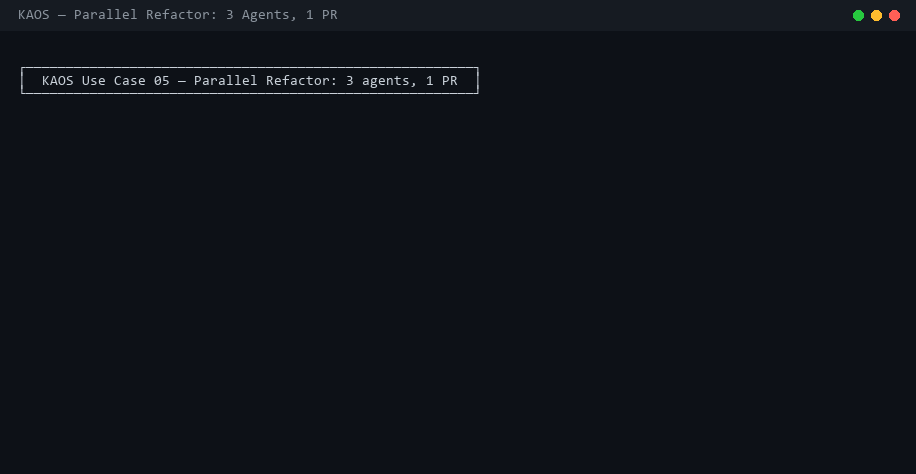
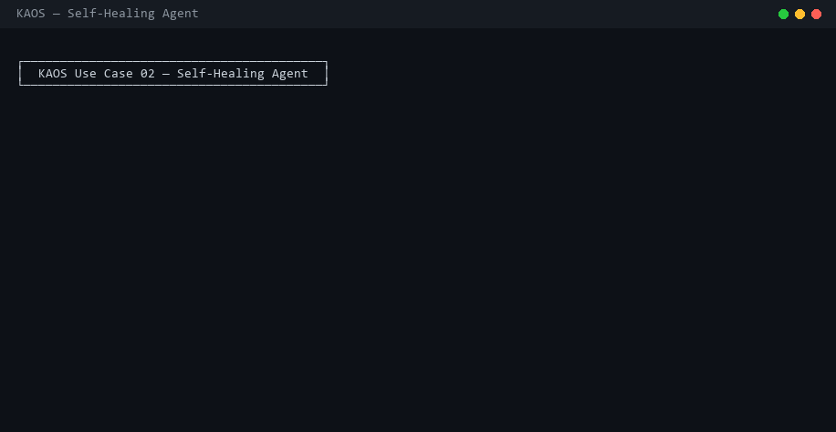

# KAOS Use Cases

Real-world patterns showing what KAOS is for and how to use it.

---

## Code Review Swarm

Run four specialized review agents in parallel — security, performance, style, and test-gap analysis — each isolated so they can't interfere with each other.


```python
# examples/code_review_swarm.py
import asyncio
from kaos import Kaos
from kaos.ccr import ClaudeCodeRunner
from kaos.router import GEPARouter

db  = Kaos("review.db")
ccr = ClaudeCodeRunner(db, GEPARouter.from_config("kaos.yaml"))

code = open("src/payments.py").read()

results = asyncio.run(ccr.run_parallel([
    {"name": "security",    "prompt": f"Find security vulnerabilities in this code:\n\n{code}"},
    {"name": "performance", "prompt": f"Find performance issues and N+1 queries:\n\n{code}"},
    {"name": "style",       "prompt": f"Review PEP 8 compliance and naming:\n\n{code}"},
    {"name": "test-gaps",   "prompt": f"What test cases are missing?\n\n{code}"},
]))

# Each agent wrote findings to its own VFS — aggregate with SQL
findings = db.query("""
    SELECT a.name, f.content
    FROM agents a
    JOIN files f ON f.agent_id = a.agent_id
    WHERE f.path = '/review.md'
    ORDER BY a.name
""")
```

**Why KAOS:** All four agents work on the same code but can't overwrite each other's findings. If one agent crashes, the others keep running. Token cost per agent is queryable: `SELECT name, SUM(token_count) FROM tool_calls JOIN agents USING (agent_id) GROUP BY name`.

---

## Parallel Refactor: Implement + Test + Document

Three tasks that are independent — write them in parallel instead of sequentially.



```python
# examples/parallel_refactor.py
results = asyncio.run(ccr.run_parallel([
    {"name": "impl",  "prompt": "Refactor auth.py to use JWT tokens, remove session-based auth"},
    {"name": "tests", "prompt": "Write pytest unit tests covering all auth flows"},
    {"name": "docs",  "prompt": "Update API reference docs for the new auth endpoints"},
]))
```

CLI equivalent:

```bash
kaos parallel \
  -t impl  "Refactor auth.py to use JWT tokens" \
  -t tests "Write pytest unit tests for auth" \
  -t docs  "Update API docs for new auth endpoints"
```

**Pattern:** Use parallel agents for any task where subtasks don't depend on each other. Implementation and docs are usually independent. Tests can be written against a spec before implementation is done.

---

## Self-Healing Agent

Checkpoint before risky work. Auto-restore on failure. Only the failed agent rolls back — others keep running.



```python
# examples/self_healing_agent.py
cp = db.checkpoint(agent, label="pre-migration")
try:
    result = await ccr.run_agent(agent, "Migrate the database schema to v3")
    if "ERROR" in result:
        raise ValueError("Migration failed")
except Exception as e:
    db.restore(agent, cp)
    print(f"Rolled back agent to pre-migration state: {e}")
    # Other agents are completely unaffected
```

**Pattern:** Always checkpoint before database migrations, file deletions, or any operation that's hard to undo. Restore is instant — it's a SQL operation, not a file copy.

---

## Post-Mortem Debugging

An agent broke something. Figure out exactly what it did, in order, with timestamps.


```bash
# What did it do?
kaos logs <agent-id>

# Read any file it wrote
kaos read <agent-id> /src/auth.py

# Diff two checkpoints — what changed?
kaos diff <agent-id> --from checkpoint-A --to checkpoint-B
```

```python
# examples/post_mortem.py

# All tool calls, in order
db.query("""
    SELECT tool_name, status, error_message, duration_ms, timestamp
    FROM tool_calls
    WHERE agent_id = ?
    ORDER BY timestamp
""", [agent_id])

# Only the failures
db.query("""
    SELECT tool_name, error_message
    FROM tool_calls
    WHERE agent_id = ? AND status = 'error'
""", [agent_id])

# Every file it touched
db.query("""
    SELECT path, version, size
    FROM files
    WHERE agent_id = ? AND deleted = 0
""", [agent_id])

# Total cost
db.query("SELECT SUM(token_count) FROM tool_calls WHERE agent_id = ?", [agent_id])
```

---

## 2am Incident Response

Production is down. An agent queries the event journal, finds the root cause, and writes the post-mortem.


```python
# Query error patterns from the last 2 hours
errors = db.query("""
    SELECT event_type, payload, timestamp
    FROM events
    WHERE event_type = 'error'
      AND timestamp > datetime('now', '-2 hours')
    ORDER BY timestamp DESC
    LIMIT 20
""")
# → 847 ConnectionPoolErrors, all after 01:17 UTC

# What config changed at that time?
changes = db.query("""
    SELECT path, timestamp
    FROM events
    WHERE event_type = 'file_write'
      AND timestamp BETWEEN datetime('now', '-3 hours') AND datetime('now', '-1 hour')
""")
```

**CLI:**
```bash
kaos query "SELECT event_type, COUNT(*) as n FROM events WHERE timestamp > datetime('now','-2 hours') GROUP BY event_type ORDER BY n DESC"
kaos search "ConnectionPoolError"
```

---

## DB Migration Rollback

A 2M-row backfill hits unexpected NULLs at row 847k. Roll back the migration agent in milliseconds while analytics agents keep running on untouched data.


```python
cp = db.checkpoint(migration_agent, label="pre-backfill")

# Run migration
result = await ccr.run_agent(migration_agent, "Backfill user_preferences with defaults")

# Check for anomalies
null_rate = db.query(
    "SELECT AVG(CASE WHEN value IS NULL THEN 1.0 ELSE 0.0 END) FROM ..."
)[0]["avg"]

if null_rate > 0.05:
    db.restore(migration_agent, cp)
    print(f"Migration rolled back. null_rate={null_rate:.1%}")
    # analytics_agent, reporting_agent, etc. are completely unaffected
```

---

## Security Audit Swarm

4 agents audit a pull request simultaneously. Each is specialized for a different vulnerability class. Findings are aggregated with a single SQL query.


```python
diff = open("pr-2847.diff").read()

await ccr.run_parallel([
    {"name": "sqli-agent",    "prompt": f"Find SQL injection vulnerabilities:\n{diff}"},
    {"name": "secrets-agent", "prompt": f"Find hardcoded secrets and API keys:\n{diff}"},
    {"name": "auth-agent",    "prompt": f"Find authentication bypass flaws:\n{diff}"},
    {"name": "deser-agent",   "prompt": f"Find unsafe deserialization:\n{diff}"},
])

# Aggregate findings — each agent wrote /findings.md to its own VFS
findings = db.query("""
    SELECT a.name, f.content
    FROM agents a JOIN files f ON f.agent_id = a.agent_id
    WHERE f.path = '/findings.md'
    ORDER BY a.name
""")
```

---

## Autonomous Research Lab

Inspired by [Karpathy's autoresearch](https://github.com/karpathy/autoresearch): run N hypothesis agents in parallel, each exploring a different direction. Results are SQL-queryable across all agents.


```python
# examples/autonomous_research_lab.py

# Each agent gets the same base training script, isolated
for direction in ["lora", "lion-optimizer", "batch-scaling", "dropout-reg"]:
    agent = db.spawn(f"{direction}-explorer")
    db.write(agent, "/train.py", BASE_TRAIN_PY)
    db.checkpoint(agent, label="baseline")

results = await ccr.run_parallel([
    {"name": "lora",           "prompt": "Apply LoRA to transformer blocks, measure val_loss"},
    {"name": "lion-optimizer", "prompt": "Replace AdamW with Lion optimizer, measure val_loss"},
    {"name": "batch-scaling",  "prompt": "Scale batch from 32→128, measure throughput+quality"},
    {"name": "dropout-reg",    "prompt": "Test dropout 0.1→0.3, measure generalization gap"},
])

# Compare across all agents with SQL
db.query("""
    SELECT a.name,
           COUNT(tc.call_id) AS experiments,
           SUM(tc.token_count) AS tokens
    FROM agents a
    JOIN tool_calls tc ON a.agent_id = tc.agent_id
    GROUP BY a.agent_id
    ORDER BY tokens DESC
""")
```

**KAOS vs vanilla autoresearch:**

| | autoresearch | KAOS |
|---|---|---|
| Agent isolation | Single process | SQL-scoped VFS per agent |
| Result storage | TSV file | SQL-queryable |
| Rollback | `git reset` | `db.restore(agent, checkpoint)` |
| Parallelism | 1 agent | N agents |
| Audit trail | Logs | Append-only event journal |

---

## SDLC Self-Healing CI

A payment service test fails after a refactor. KAOS detects the regression, restores from checkpoint, traces the root cause from the audit trail, and applies the correct fix — no human intervention.


```python
# Checkpoint before each fix attempt
cp = db.checkpoint(qa_agent, label="before-fix")
result = await ccr.run_agent(qa_agent, "Fix the failing payment test")

if result.tests_failed > 0:
    db.restore(qa_agent, cp)  # instant — SQL operation
    root_cause = db.read(qa_agent, "/qa/failure_report.md")
    # → "Decimal precision lost via float(amount) — use Decimal(str(amount))"
    result = await ccr.run_agent(qa_agent, f"Fix: {root_cause}")
```

---

## ML Research: -19.2% val_loss in One Run

4 agents explore orthogonal model improvements simultaneously. The winner is checkpointed and a research compendium writes itself.


```python
results = await ccr.run_parallel([
    {"name": "arch-explorer",  "prompt": "Apply LoRA to transformer blocks, report val_loss"},
    {"name": "optim-explorer", "prompt": "Try Lion optimizer vs AdamW, same LR schedule"},
    {"name": "scale-explorer", "prompt": "Scale batch 32→128, measure throughput and quality"},
    {"name": "reg-explorer",   "prompt": "Test dropout 0.1→0.3, measure generalization"},
])

# Winner: arch-explorer val_loss=1.89 (-19.2% vs baseline 2.34)
winner_id = db.query("""
    SELECT agent_id FROM agents
    JOIN state ON agents.agent_id = state.agent_id
    WHERE state.key = 'val_loss'
    ORDER BY CAST(state.value AS REAL) ASC LIMIT 1
""")[0]["agent_id"]

db.checkpoint(winner_id, label="winning-experiment")
```

---

## Model Regression Guard

A model swap drops accuracy from 0.83 → 0.76. The CI gate catches it, blocks the deploy, and triggers a Meta-Harness repair run that automatically restores 0.83.


```python
results = await run_benchmarks_vs_baseline(new_model)
regressions = [r for r in results if r.delta < -0.05]

if regressions:
    # Block deploy — trigger automatic repair
    search = MetaHarnessSearch(db, router, bench, SearchConfig(max_iterations=5))
    repair = await search.run()
    # 5 iterations → 0.83 restored. Deploy proceeds.
```

---

## Export & Share

```bash
# Export one agent's complete state to a standalone file
kaos export <agent-id> -o agent-snapshot.db

# Share it — teammate imports it
kaos import agent-snapshot.db

# Or just copy the whole database
cp kaos.db full-backup-$(date +%Y%m%d).db
```

Everything — files, tool calls, state, events, checkpoints — is in one `.db` file. Open it in DBeaver, DataGrip, or the `sqlite3` CLI.
