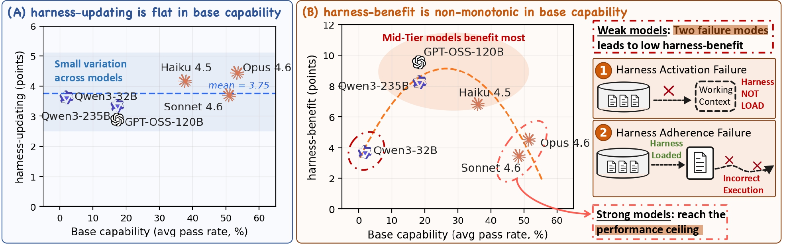

# Harness Updating Is Not Harness Benefit

[](https://arxiv.org/abs/2605.30621)

This directory contains the A-Evolve artifact for **"Harness Updating Is Not Harness Benefit: Disentangling Evolution Capabilities in Self-Evolving LLM Agents."** It is staged under `examples/harness-disentangling/` so the paper artifact can live on the main branch without replacing the project README or rewriting the existing framework modules.

If you find this work helpful, please cite:

```bibtex
@article{lin2026harness,
  title={Harness Updating Is Not Harness Benefit: Disentangling Evolution Capabilities in Self-Evolving LLM Agents},
  author={Lin, Minhua and Wu, Juncheng and Wang, Zijun and Shi, Zhan and Sang, Yisi and He, Bing and Liu, Zewen and Wei, Tianxin and Wu, Zongyu and Zhang, Zhiwei and Wang, Dakuo and Zhang, Xiang and Dumoulin, Benoit and Xie, Cihang and Zhou, Yuyin and Wang, Suhang and Lu, Hanqing},
  journal={arXiv preprint arXiv:2605.30621},
  year={2026}
}
```

## Overview

LLM agents are increasingly deployed as systems built around an editable external **harness**: prompts, skills, memories, and tools that shape task execution without changing model parameters. *Harness self-evolution* adapts such an agent by updating this harness from execution evidence.

<p align="center">
  
</p>

The paper separates two capabilities in this loop:

1. **Harness-updating**, exercised by the evolver, is the capability to produce useful persistent harness updates from evidence.
2. **Harness-benefit**, exercised by the task-solving agent, is the capability to use updated harnesses during task solving.

Across SWE-bench Verified, MCP-Atlas, and SkillsBench, the analysis shows that harness-updating is comparatively flat across base model capability, while harness-benefit is non-monotonic: weak models often fail to load or follow the harness, mid-tier models benefit most, and stronger models can approach a performance ceiling.

## Main-Branch Layout

This port keeps the artifact localized and avoids the broad `agent_evolve/` replacement that would make a direct merge from the release branch conflict-heavy.

```text
examples/harness-disentangling/
├── README.md
├── assets/figures/fig_intro_findings_v2.jpg
├── _region_picker.py
├── model_region_availability.json
├── run_exp0_unified_insitu.py        # Exp0: vary evolver, fix agent anchors
├── run_exp1_unified_insitu.py        # Exp1: vary agent, in-situ route
├── run_exp1.py                       # Exp1: train/test split route
├── scripts/                          # single-seed sweep and status helpers
└── hfr_analysis/                     # agent-side Harness-Following Rate diagnostics

agent_evolve/algorithms/unified/      # Added UnifiedEngine implementation
examples/{swe,mcp,skillbench}_examples/
                                      # thin benchmark runners used by the artifact launchers
```

The HFR pipeline is an agent-side diagnostic for explaining low harness-benefit. It is intentionally kept as a subsection of this artifact rather than as a top-level project feature.

## Installation

Install from the repository root:

```bash
git clone https://github.com/A-EVO-Lab/a-evolve.git
cd a-evolve

conda create -n aevolve python=3.11 -y
conda activate aevolve

pip install -e ".[swe,mcp,skillbench,dev]"
```

Optional extras are benchmark-specific: `swe`, `mcp`, `skillbench`, plus `dev` for tests and linting.

Runtime credentials are read from the standard project environment. For the paper scripts, short model nicknames such as `opus46`, `sonnet46`, `haiku45`, `qwen235b`, `qwen32b`, `qwen35_9b`, and `gptoss120b` are resolved by:

```text
examples/harness-disentangling/model_region_availability.json
```

For local OpenAI-compatible evolvers such as `qwen35_9b`, set `EVOLVER_OPENAI_BASE_URL` or `OPENAI_BASE_URL` as appropriate.

## Artifact Entry Points

Run commands from the repository root. `--evolver none` is the no-evolution baseline.

### Exp0: Harness-Updating

Fix the task-solving agent anchors and vary the evolver to measure harness-updating.

```bash
python examples/harness-disentangling/run_exp0_unified_insitu.py \
  --solver opus46 --evolver qwen35_9b --benchmark mcp --seed 42 \
  --region-strategy hash --output-root results/exp0_unified_insitu
```

Single-seed sweep:

```bash
bash examples/harness-disentangling/scripts/phase0_unified_insitu_single_seed.sh
```

### Exp1: Harness-Benefit

Fix the evolver anchors and vary the task-solving agent to measure harness-benefit.

```bash
python examples/harness-disentangling/run_exp1_unified_insitu.py \
  --solver qwen32b --evolver opus46 --benchmark sb --seed 42 \
  --region-strategy hash --output-root results/exp1_unified_insitu
```

Single-seed sweep and dashboard:

```bash
bash examples/harness-disentangling/scripts/phase1_unified_insitu_single_seed.sh
bash examples/harness-disentangling/scripts/check_status.sh
```

`run_exp1.py` provides the train/test split variant for estimating harness-benefit on held-out tasks.

### HFR Diagnostic

The Harness-Following Rate pipeline measures how faithfully an agent follows procedural instructions in evolved SkillsBench skills.

```bash
python examples/harness-disentangling/hfr_analysis/pipeline.py --max-workers 4 --stages 1,2,4
```

## Benchmarks

- **SWE-bench Verified** (`swe`): uses the SWE-bench Docker harness and `seed_workspaces/swe/`.
- **MCP-Atlas** (`mcp`): uses MCP server containers, API keys from the configured environment file, and `seed_workspaces/mcp/`.
- **SkillsBench** (`sb`): uses the SkillsBench task set and `seed_workspaces/skillbench-upstream-parity/`.

The full paper-scale sweeps require benchmark credentials, Docker, and provider access. This main-branch port keeps the paper orchestration and unified engine in place while preserving the existing A-Evolve framework surface.

## Models

| Nickname | Model | Example provider model ID |
|----------|-------|---------------------------|
| `opus46` | Claude Opus 4.6 | `us.anthropic.claude-opus-4-6-v1` |
| `sonnet46` | Claude Sonnet 4.6 | `us.anthropic.claude-sonnet-4-6-v1` |
| `haiku45` | Claude Haiku 4.5 | `us.anthropic.claude-haiku-4-5-v1` |
| `qwen235b` | Qwen3-235B-A22B | see `model_region_availability.json` |
| `qwen32b` | Qwen3-32B | see `model_region_availability.json` |
| `qwen35_9b` | Qwen3.5-9B | see `model_region_availability.json` |
| `gptoss120b` | GPT-OSS-120B | see `model_region_availability.json` |
